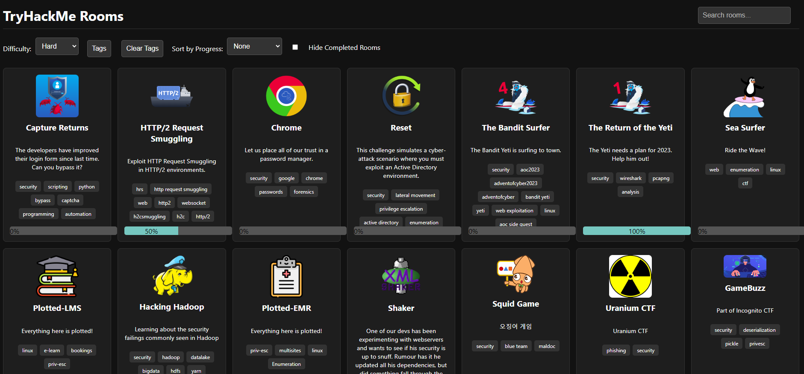

# TryHackMe Windows Filter :closed_lock_with_key:

Welcome to the TryHackMe Windows Filter project! This project helps you fetch TryHackMe rooms and categorize them based on whether they have the "Windows" tag or not. The purpose is to help you find non-Windows rooms you haven't completed yet. 

<p align="center">
  
</p>

## Table of Contents
- [Introduction](#introduction)
- [Prerequisites](#prerequisites)
- [Setup](#setup)
- [Usage](#usage)
- [Customization](#customization)
- [Contributing](#contributing)
- [License](#license)

## Introduction :books:
This project contains:
- A Python script that fetches TryHackMe rooms and categorizes them based on the presence of the "Windows" tag.
- An HTML file that displays non-Windows rooms in a user-friendly format with links to the rooms.

## Prerequisites :heavy_check_mark:
- Python 3.x
- `requests` library (install using `pip install requests`)
- A TryHackMe account and an active session cookie.

## Setup :gear:
1. Clone this repository:
    ```sh
    git clone https://github.com/pentestfunctions/tryhackme_uncompleted.git
    cd tryhackme_uncompleted
    ```

2. Update the `cookie` variable in the `tryhackme_windows_filter.py` file with your TryHackMe session cookie:
    ```python
    cookie = "CONNECT_SID_GOES_HERE"
    ```

## Usage :computer:
1. Run the Python script to fetch and categorize the rooms:
    ```sh
    python tryhackme_windows_filter.py
    ```

    This will generate a JSON file:
   - Inside this file will be the all the free rooms *(unless you adjusted the paramter in the python script) and your progress.

3. Serve the HTML file to view the non-Windows rooms:
    ```sh
    sudo python -m http.server 80
    ```
    Open your web browser and go to `http://localhost:80/index.html` to view the non-Windows rooms.

    Alternatively, you can directly open the `index.html` file in your web browser.

## Customization :wrench:
- **Free Rooms to All Rooms**: To change the script to fetch all rooms instead of just free rooms, modify the `contentSubType` parameter in the `fetch_rooms` function:
    ```python
    params = {
        "kind": "all",
        "difficulty": "all",
        "order": "relevance",
        "roomType": "all",
        "contentSubType": "all",  # Change from 'free' to 'all' for all rooms.
        "limit": 100
    }
    ```

## Contributing :handshake:
We welcome contributions to enhance this project! Feel free to open issues or submit pull requests.

## License :page_facing_up:
This project is licensed under the MIT License. See the [LICENSE](LICENSE) file for details.

## Contact
For any queries or suggestions, please reach out to the project maintainer.

Happy hacking! :crossed_swords:
